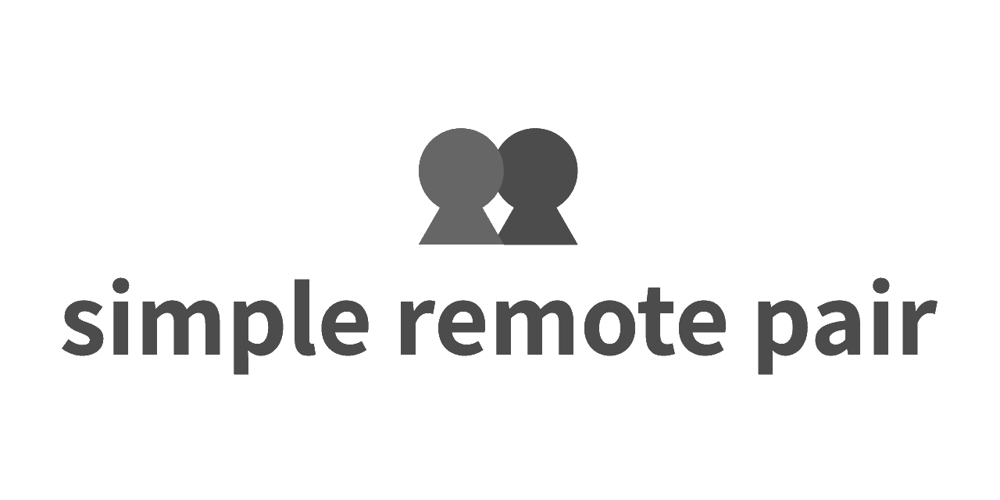
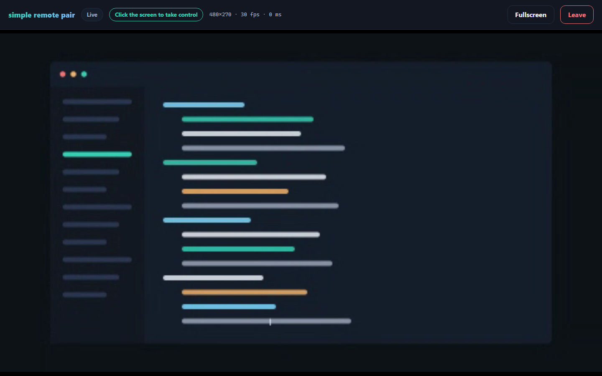
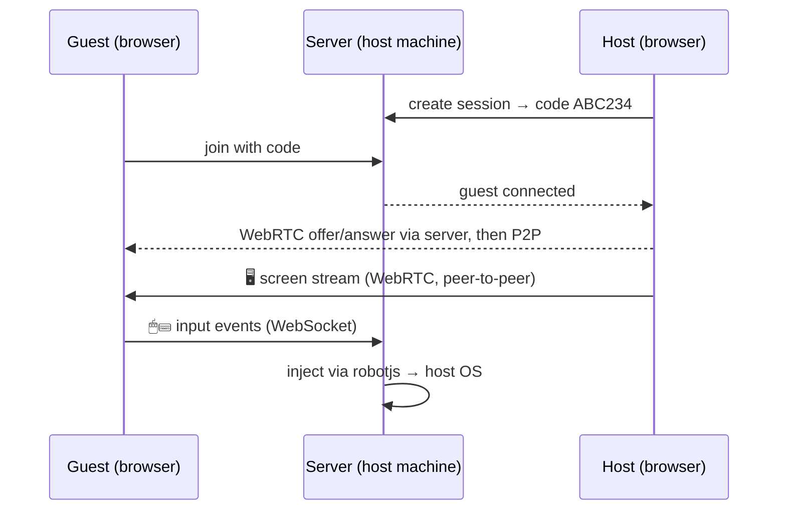
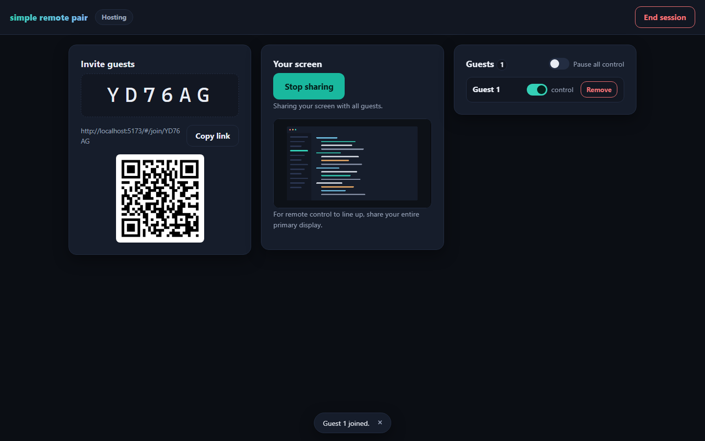

<h1 align="center"></h1>

<p align="center">
  Self-hosted pair programming: stream your screen over WebRTC and hand mouse &amp; keyboard<br>
  to guests on your LAN or VPN. <strong>No cloud, no accounts, no latency tax.</strong>
</p>

<p align="center">
  <a href="https://github.com/jeeanribeiro/simple-remote-pair/actions/workflows/ci.yml"></a>
  <a href="https://www.npmjs.com/package/simple-remote-pair"></a>
  = 20.19" src="https://img.shields.io/node/v/simple-remote-pair">
  <a href="LICENSE"></a>
</p>

<p align="center">
  
</p>

## How it works

The host runs one small server on their machine. Everything else is a browser tab.



- **Screen video** goes browser-to-browser over WebRTC — the server only relays the handshake.
- **Mouse & keyboard events** go to the server, which validates them and injects them into the host OS with [@hurdlegroup/robotjs](https://github.com/hurdlegroup/robotjs) (prebuilt binaries — no compiler toolchain needed).
- **Sessions are gated by one-time codes**; the host can revoke control per guest, pause everyone, or kick.

## Quick start

```sh
npx simple-remote-pair
```

That prints your LAN URLs and a QR code. Open the URL, click **Start hosting**, share the 6-character code — done. Guests join from any modern browser; nothing to install on their side.

### Prefer a desktop app?

Download a native installer from the [latest release](https://github.com/jeeanribeiro/simple-remote-pair/releases/latest) — Windows (`.exe`), macOS (`.dmg`, Intel & Apple Silicon), or Linux (`.AppImage` / `.deb`). It's a single ~10 MB binary with **no Node.js required**: same web client, same protocol, with a native Rust server (see [`desktop/`](desktop/README.md)).

From a source checkout instead:

```sh
git clone https://github.com/jeeanribeiro/simple-remote-pair.git
cd simple-remote-pair
npm install && npm run build
npm start
```

### CLI options

| Flag | Default | What it does |
| --- | --- | --- |
| `-p, --port <n>` | `3000` | Port to listen on |
| `--host <addr>` | `0.0.0.0` | Address to bind |
| `--view-only` | off | Never inject input; guests can only watch |
| `--max-guests <n>` | `8` | Guests allowed per session |
| `--injector <kind>` | `auto` | `auto` \| `robotjs` \| `noop` \| `fake` |
| `-q, --quiet` | off | Only print errors |

If the native robotjs module can't load on your platform, the server keeps working in **view-only mode** instead of failing to start.

## Features

- **Multi-guest** — up to 8 guests per session, each with an independent control toggle
- **Take/release control** — guests click the screen to drive, double-tap <kbd>Esc</kbd> to release; window blur and disconnects auto-release every held key and button so nothing ever sticks on the host
- **Letterbox-accurate input** — pointer mapping accounts for `object-fit: contain`, so clicks land exactly where you aim at any window size
- **Fullscreen + Keyboard Lock** — in fullscreen (Chromium), even <kbd>Tab</kbd>, <kbd>Alt</kbd> and <kbd>Ctrl</kbd>+<kbd>W</kbd> reach the host
- **Live stats** — resolution, fps and round-trip time in the guest toolbar
- **QR join links** — in the terminal and in the host view
- **Accessible** — keyboard operable throughout, visible focus, screen-reader announcements, honors reduced-motion, no keyboard traps

<p align="center">
  
</p>

## Security model

This is a **trusted-network tool** — think office LAN, home network, or a VPN like Tailscale/WireGuard. It is not designed to face the public internet.

What the server enforces:

- Guests must present a valid **session code** (6 chars, 31-character unambiguous alphabet, generated with `crypto.randomInt`) before they can signal or send input. Repeated wrong codes disconnect the socket, so codes can't be brute-forced.
- Every inbound message is **schema-validated**; malformed traffic is dropped and repeat offenders are disconnected. Input is **rate-limited** per guest.
- WebSocket upgrades are **same-origin only** (cross-site pages can't drive the server), and hosts are capped per device.
- Input is only injected while the guest **has control**, the session **isn't paused**, and an injector is available. Revoking control releases everything the guest held.
- Static responses ship a strict **Content-Security-Policy** and friends; the WebSocket layer caps message sizes.
- The host can pause all control, revoke per guest, kick, or end the session at any time — ending it disconnects everyone.

What it deliberately does not do: TLS termination (put it behind a reverse proxy if you need `https://`), user accounts, or internet-facing NAT traversal (no STUN/TURN — LAN/VPN host candidates only).

Found a vulnerability? See [SECURITY.md](SECURITY.md).

## Known limitations

- **Share your entire primary display** for control mapping to line up — sharing a window or a secondary monitor still streams fine, but remote clicks map to the primary screen.
- Punctuation and accented characters are injected as text on key-down (robotjs can only toggle a fixed key set), so shortcuts like <kbd>Ctrl</kbd>+<kbd>/</kbd> may not register on the host.
- Outside fullscreen, the browser keeps a few reserved shortcuts (<kbd>Ctrl</kbd>+<kbd>W</kbd>, <kbd>Ctrl</kbd>+<kbd>T</kbd>…) for itself.

## Development

```sh
npm install
npm run dev          # Vite + session server in one process, one port
```

The dev server plugin attaches the WebSocket hub to Vite's own HTTP server, so hot reload and the signaling/input path share one origin. Set `SRP_INJECTOR=fake` to record injections in memory instead of moving your real mouse (inspect them at `/__test/injections`).

```sh
npm run verify       # lint + typecheck + unit tests + build
npm test             # vitest unit & integration tests
npm run test:e2e     # Playwright: real browsers, real WebRTC, fake injector
npm run lint:fix     # Biome, auto-fix
```

The stack: TypeScript (strict) end to end, Vite for the client, plain `RTCPeerConnection` (no wrapper libs), `ws` + a small validated JSON protocol shared between client and server, Biome for lint/format, Vitest + Playwright for tests. The runtime dependency tree is three packages: `ws`, `sirv`, `uqr` — plus optional `@hurdlegroup/robotjs`. The client JS bundle is ~10 kB gzipped (~13 kB with CSS and HTML).

Project layout:

```
src/shared/     wire protocol: message types + validators (used by both sides)
src/server/     session hub, input injection, keymap, CLI, static serving
src/client/     vanilla-TS views (home / host / guest), WebRTC, input capture
tests/          unit + integration (real WebSockets against the hub)
e2e/            Playwright: host↔guest flows over real WebRTC
desktop/        Tauri desktop app — native Rust server, same client & protocol
```

## Contributing

Issues and PRs are welcome — see [CONTRIBUTING.md](CONTRIBUTING.md).

## License

[MIT](LICENSE) © [Jean Ribeiro](https://jeanribeiro.dev)
